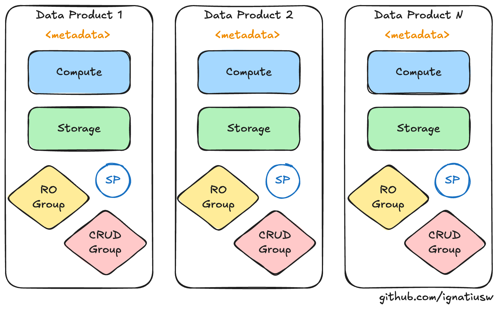
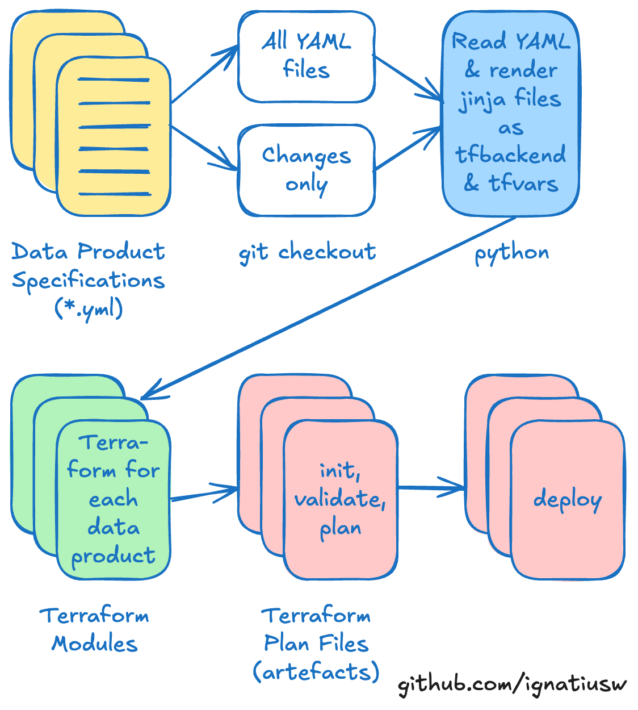

# Data Product at Scale

Demo repository to showcase how you can deploy data product at scale using a combination Terraform, Jinja template, and Python.

## 🎯 Overview

This project demonstrates how to:
- **Scale data product deployment** across multiple environments
- **Standardize data governance** with consistent naming and permissions  
- **Automate infrastructure provisioning** using Terraform modules
- **Ensure data product uniqueness** through automated validation
- **Template-driven configuration** for consistent deployments

## 🏗️ Architecture

```
┌─────────────────┐    ┌─────────────────┐    ┌─────────────────┐
│   YAML Config   │ -> │  Python Script  │ -> │  Terraform IaC  │
│  (Data Product) │    │   (Generator)   │    │ (Databricks)    │
└─────────────────┘    └─────────────────┘    └─────────────────┘
        │                       │                       │
        ├── Data Definition     ├── Template Rendering  ├── Infrastructure
        ├── User Permissions    ├── Name Standardisation├── User Management  
        ├── Compute Config      ├── Validation          ├── Catalog/Schema
        └── Classification      └── Multi-Environment   └── Permissions
```

Each Data Product has similar components, just different contents.



## 📁 Project Structure

```
demo-data-product-at-scale/
├── data-products/                         # 📄 Data product configurations
│   ├── death-star.yaml                    #    Example: Confidential data product
│   └── starkiller-base.yaml               #    Example: Highly confidential data product
├── src/
│   ├── python/                            # 🐍 Template generation engine
│   │   └── data-product.py                #    Core generator script
│   └── terraform/
│       ├── modules/
│       │   └── data_product_setup/        # 🏗️ Reusable Terraform module
│       │       ├── main.tf                #    Resource definitions
│       │       ├── data.tf                #    Data sources for existing resources, also to execute SQL statement against Databricks
│       │       ├── variables.tf           #    Input variables
│       │       ├── outputs.tf             #    Output values
│       │       ├── locals.tf              #    Local values and naming
│       │       └── providers.tf           #    Module provider configurations
│       └── template/                      # 📋 Jinja2 templates
│           ├── main.tf                    #    Main Terraform configuration
│           ├── variables.tf               #    Variable definitions
│           ├── providers.tf               #    Provider configurations
│           ├── backend.tf                 #    Backend configuration
│           ├── versions.tf                #    Version constraints
│           ├── data-product.tfvars.jinja  #    Data Product specific variables
│           └── backend.config.jinja       #    Data Product specific backend configuration
└── tests/                                 # 🧪 Automated validation
    └── test_data_product_uniqueness.py    #    Name uniqueness validation
```

## 🚀 Quick Start

The steps below will create terraform resources for each data product and deploy them accordingly.



### Prerequisites

- **Databricks Workspace**: Access to a Databricks workspace (Free or Paid edition)<br/>
  ⚠️ **Important Note:** If you are using the Free edition, catalog (database) cannot be created via
  Terraform, you will need to create the catalog first based on the data product name with all lower
  case, and non-alphanumeric characters (`[A-Za-z0-9]`) replaced with underscore (`_`)
- **Python 3.13.7**: With pyenv for environment management
- **Terraform 1.13.0**: For infrastructure provisioning  
- **Git**: For version control
- **MacOS**: To run the demo

### 1. Environment Setup

```bash
# Clone the repository
git clone https://github.com/ignatiusw/demo-data-product-at-scale.git
cd demo-data-product-at-scale

# Initialize environment (installs dependencies and activates virtual environment)
source ./scripts/init.sh
```

### 2. Set Up Local Environment for Terraform

```bash
# Set up DATABRICKS_HOST, DATABRICKS_TOKEN, and DATABRICKS_ACCOUNT_ID
source ./scripts/local_env.sh
```

### 3. Create Your Data Product

Create a new YAML file in `data-products/` (or use the examples provided):

```yaml
# data-products/my-product.yaml
name: My Data Product
description: Analytics data product for customer insights
classification: Internal
owner:
  division: Data & Analytics
  business unit: Customer Analytics
  contacts:
    - alice.smith@company.com
    - bob.jones@company.com
users:
  read-only:
    - analyst1@company.com
    - analyst2@company.com
  modify:
    - engineer1@company.com
    - engineer2@company.com
compute:
  - type: sql
    name: Analytics SQL Cluster
    cluster_size: Large
```

### 4. Run the CI script

The generated terraform files will be created in `src/terraform/output/`.

⚠️ **Important Note:** This repo currently stores the terraform state file locally
in the same folder as the terraform outputs. This means every time you run
this, it will remove the output folder along with the terraform state file.
If you want to keep the terraform state file, please make a back up copy of
it first before running the CI script, or use another location to store
the terraform file (you'll need to update the backend and/or the config).

If you just need to run only those data products that change, use the below:
```bash
# Run the CI script by passing the environment (dev, test or prod)
source ./scripts/ci.sh dev
```

If you need to run all the data product, use the below:
```bash
# Run the CI script by passing the environment (dev, test or prod)
source ./scripts/ci-all.sh dev
```

### 5. Run the CD script

This will deploy the saved plan(s) stored in `src/terraform/output/`.

⚠️ **Important Note:** As per the above note, the terraform state file is stored
locally in the above folder, which will be deleted if you re-run the CI script.
If you want to keep the terraform state file, please make a back up copy of
it first before running the CI script, or use another location to store
the terraform file (you'll need to update the backend and/or the config).

```bash
# Run the CD script
source ./scripts/cd.sh
```

## 📝 Data Product Configuration

### YAML Schema

| Field | Required | Type | Description |
|-------|----------|------|-------------|
| `name` | ✅ | string | Unique data product name |
| `description` | ✅ | string | Product description |
| `classification` | ✅ | enum | Data classification (Public, Internal, Confidential, Highly Confidential) |
| `owner.division` | ✅ | string | Owning division |
| `owner.business_unit` | ✅ | string | Owning business unit |
| `owner.contacts` | ✅ | array | List of owner email addresses |
| `users.read-only` | ❌ | array | Users with read-only access |
| `users.modify` | ❌ | array | Users with modify access |
| `compute` | ❌ | array | Compute cluster configurations |

### Example Configuration

```yaml
name: Customer Analytics Hub
description: Centralized customer data and analytics platform
classification: Internal
owner:
  division: Data & Analytics
  business unit: Customer Intelligence
  contacts:
    - data-team-lead@company.com
    - customer-analytics-manager@company.com
users:
  read-only:
    - business-analyst@company.com
    - product-manager@company.com
  modify:
    - data-engineer@company.com
    - senior-analyst@company.com
compute:
  - type: sql
    name: Customer Analytics SQL Cluster  
    cluster_size: X-Large
  - type: classic
    name: ML Training Cluster
    cluster_size: 2X-Large
```

## 🏗️ Terraform Module: `data_product_setup`

The core Terraform module that provisions Databricks resources for each data product.

### Resources Created

- **📚 Unity Catalog**: Isolated data catalog per product
- **📁 Default Schema**: `bronze` schema for raw data ingestion  
- **📂 Managed Volume**: Cloud storage integration
- **🗂️ Directory Structure**: Organized workspace folders
- **👥 User Groups**: Separate read-only and modify groups
- **🔐 Permissions**: Granular catalog and schema permissions
- **🏷️ Service Principals**: For automated workflows

### Module Usage

```hcl
module "data_product" {
  source = "./modules/data_product_setup"
  
  providers = {
      databricks         = databricks
      databricks.account = databricks.account
  }

  environment = "dev"

  data_product_name        = "demo-data-product"
  data_product_description = "A demo data product for showcasing data product at scale"
  data_product_tags        = {
    "classification" = "Internal"
    "division"       = "Data & Analytics"
    "business unit"  = "Data Platforms & Engineering"
    "contacts"      = "[\"data-team@demo-data-product-at-scale.com\", \"ignatius.soputro@demo-data-product-at-scale.com\"]"
  }
  
  data_product_users = {
    "read-only" = ["Alice in Wonderland", "Bob the Builder"]
    "modify"    = ["Charlie Brown", "Dora the Explorer", "Ethan Hunt"]
  }

  # Optional
  email_domain = "demo"
}
```

### Outputs

| Output | Description |
|--------|-------------|
| `catalog_name` | Created Unity Catalog name |
| `schema_names` | List of created schema names |
| `volume_names` | List of created volume names |  
| `directory_paths` | Workspace directory paths |
| `group_names` | Created user group names |
| `group_memberships` | User group membership details |
| `permissions` | Applied permission summaries |

## 🐍 Python Generator: `data-product.py`

The core Python script that transforms YAML configurations into Terraform deployments.

### Features

- **🔧 Template Rendering**: Jinja2-based Terraform generation
- **📝 Name Standardization**: Consistent naming across resources  
- **✅ Input Validation**: YAML schema and business rule validation
- **🌍 Multi-Environment**: Dev, test, prod environment support
- **📊 Detailed Logging**: Debug and operational logging

### Usage

```bash
# Generate single data product
python src/python/data-product.py <environment> <yaml-file> [--debug]

# Examples
python src/python/data-product.py dev data-products/my-product.yaml
python src/python/data-product.py prod data-products/customer-hub.yaml --debug

# Generate all data products in folder  
python src/python/data-product.py dev data-products/
```

### Name Standardisation

The generator applies consistent naming conventions:

```python
def standardise_data_product_name(name: str) -> str:
    """Convert name to lowercase with hyphens."""
    return re.sub(r'[^a-zA-Z0-9]', '-', name.lower())

# Examples:
# "Customer Analytics Hub" -> "customer-analytics-hub"  
# "ML_Training Data" -> "ml-training-data"
# "Product Data (V2)" -> "product-data-v2"
```

## 🧪 Automated Testing

### Test Suite: `test_data_product_uniqueness.py`

Comprehensive pytest suite ensuring data product integrity:

#### Test Cases

1. **📁 Directory Validation**: Ensures data-products folder exists with YAML files
2. **📋 Schema Validation**: Validates all YAML files have required `name` field
3. **🔄 Uniqueness Check**: Prevents duplicate data product names
4. **🔤 Case Sensitivity**: Detects case-insensitive duplicates

#### Running Tests

```bash
# Run all uniqueness tests
python -m pytest tests/test_data_product_uniqueness.py -v

# Run specific test
python -m pytest tests/test_data_product_uniqueness.py::TestDataProductUniqueness::test_data_product_names_are_unique -v

# Run with detailed output
python -m pytest tests/ -v --tb=short
```

#### Example Test Output

```bash
tests/test_data_product_uniqueness.py::TestDataProductUniqueness::test_yaml_files_exist PASSED
tests/test_data_product_uniqueness.py::TestDataProductUniqueness::test_yaml_files_have_name_field PASSED  
tests/test_data_product_uniqueness.py::TestDataProductUniqueness::test_data_product_names_are_unique PASSED
tests/test_data_product_uniqueness.py::TestDataProductUniqueness::test_data_product_names_case_sensitivity PASSED
```

## 🔄 CI/CD Integration

### Continuous Integration Script

The `scripts/ci.sh` provides automated validation and deployment:

```bash
# Run CI pipeline
bash scripts/ci.sh <environment>

# Examples
bash scripts/ci.sh dev
bash scripts/ci.sh prod
```

#### CI Pipeline Steps

1. **🔧 Environment Setup**: Activates Python virtual environment
2. **🧪 Test Execution**: Runs data product uniqueness validation  
3. **📊 Change Detection**: Identifies modified YAML files via Git
4. **🏗️ Template Generation**: Generates Terraform for changed products
5. **📋 Validation Report**: Provides deployment readiness summary

#### Sample CI Output

```bash
Running CI tasks for demo-data-product-at-scale...
Activating virtual environment...
Checking data product name uniqueness...
✅ 4 passed in 0.01s

Checking for modified data product files...
Modified data product files:
- data-products/customer-hub.yaml
- data-products/ml-platform.yaml

Generating terraform output for: data-products/customer-hub.yaml
✅ Rendered templates -> ./src/terraform/output/customer-hub
All CI tasks completed successfully!
```

## 🌍 Multi-Environment Support

### Environment Configuration

The framework supports multiple deployment environments:

- **🧪 `dev`**: Development environment for testing
- **🔧 `test`**: Integration testing environment  
- **🚀 `prod`**: Production environment

### Environment-Specific Features

- **Backend Configuration**: Different Terraform state backends
- **Variable Templating**: Environment-specific variable values
- **Resource Naming**: Environment prefixes for resource isolation
- **Permission Scoping**: Environment-appropriate access controls

### Template Structure

```bash
src/terraform/template/
├── backend.config.jinja      # Environment-specific backend config
├── data-product.tfvars.jinja # Environment-specific variables
└── *.tf                      # Static Terraform configurations
```

## 📊 Governance & Compliance

### Data Classification

The framework enforces data governance through classification:

| Classification | Access Level | Use Case |
|---------------|--------------|----------|
| `Public` | Open access | Public datasets, documentation |
| `Internal` | Company-wide | Internal analytics, reporting |
| `Confidential` | Restricted | Customer data, financial info |
| `Highly Confidential` | Highly restricted | PII, sensitive business data |

### Audit Trail

- **📋 YAML Configuration**: Version-controlled data product definitions
- **🏗️ Infrastructure History**: Terraform state and plan files  
- **👥 Access Control**: Group-based permission management
- **📊 Change Tracking**: Git-based change detection and deployment

## 🔧 Advanced Usage

### Custom Compute Configurations

```yaml
compute:
  - type: sql
    name: Analytics Warehouse  
    cluster_size: X-Large
    auto_termination_minutes: 30
  - type: classic
    name: ML Training Cluster
    cluster_size: 2X-Large  
    min_workers: 2
    max_workers: 10
```

### Service Principal Integration

```yaml
# Automated workflow access
service_principals:
  - name: etl-pipeline-sp
    permissions: modify
  - name: reporting-sp  
    permissions: read-only
```

### Multi-Schema Support

```yaml
# Multiple data layers
schemas:
  - name: bronze
    description: Raw data ingestion layer
  - name: silver  
    description: Cleaned and validated data
  - name: gold
    description: Business-ready analytics data
```

## 🚨 Troubleshooting

### Common Issues

#### 1. **Import Errors**
```bash
ModuleNotFoundError: No module named 'yaml'
```
**Solution**: Activate virtual environment with `source scripts/init.sh`

#### 2. **Terraform Backend Issues**  
```bash
Error: Backend configuration changed
```
**Solution**: Run `terraform init -reconfigure -backend-config=backend.config`

#### 3. **Duplicate Names**
```bash
Failed: Duplicate data product names found
```
**Solution**: Ensure all YAML files have unique `name` fields

#### 4. **Permission Denied**
```bash
Error: insufficient privileges
```
**Solution**: Verify Databricks workspace permissions and CLI configuration

### Getting Help

1. **📋 Check Logs**: Enable debug mode with `--debug` flag
2. **🧪 Run Tests**: Execute `python -m pytest tests/ -v`  
3. **🔧 Validate Config**: Ensure YAML syntax and required fields
4. **📊 Review State**: Check Terraform state files for conflicts

## 🤝 Contributing

### Development Workflow

1. **🍴 Fork Repository**: Create your feature branch
2. **📝 Add Data Products**: Create YAML configurations in `data-products/`
3. **🧪 Run Tests**: Validate with `python -m pytest tests/ -v`
4. **🔄 Test CI**: Execute `bash scripts/ci.sh dev`  
5. **📋 Submit PR**: Include test results and documentation updates

### Code Standards

- **🐍 Python**: Follow PEP 8 style guidelines
- **🏗️ Terraform**: Use consistent formatting with `terraform fmt`
- **📝 YAML**: Maintain consistent indentation and structure
- **📋 Documentation**: Update README for new features

---

## 📜 License

This project is licensed under the MIT License - see the [LICENSE](LICENSE) file for details.

## 🏷️ Version

Current Version: **1.0.0**

**Compatibility:**
- Databricks Runtime: 13.x+
- Terraform: 1.13.0+  
- Python: 3.13.7+
- Unity Catalog: Required

---

*Built with ❤️ for scalable data product management*

---

*Disclaimer: Most of this README.md content are AI generated*